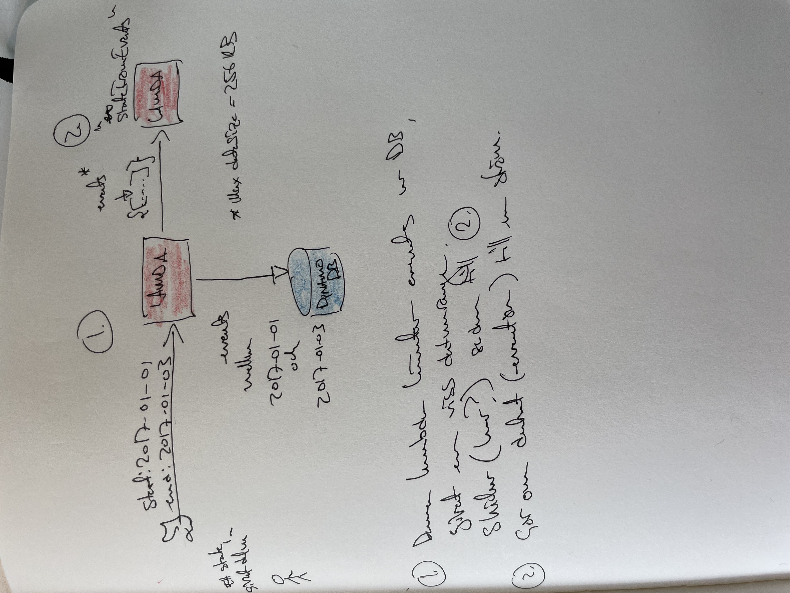

# fivepelo-aggr
Bygger ett state för en viss period av träningsdata utifrån data i Google Sheets.
Process:
 1. Parsa ett Google sheet till ett format man kan bygga en eventström av (_sheets_)
 2. Parsa formatet ovan till en eventström, som kan sparas i DynamoDB i AWS (_eventstream_)
 3. Tillverka ett state utifrån en eventström (_state_)

Första argumentet är sheet-fil, nedladdad med scripten i sheets-mappen. Andra argumentet är en ren filterparameter, för den person man vill se, den är optional.

## Sheets
### Aggregera data från Google sheets
Genererar data från ett träningsark på formatet

```json
{
  "startDate": "2016-07-25",
  "trainingData": [
    {
      "name": "Lotta",
      "training": [
        [
          "",
          "60 PT plus cykling 40",
          "trail cykling 60",
          "trail cykling 50",
          "",
          "bakislöpning 30, cykling 30 ",
          "vattenland och promenad 30"
        ],
        [
          "",
          "PT 60 min fokus ben, cykla 30 min",
          "cykling 30 min",
          "",
          "cykling 1h10min trail",
          "Löpning 50 min",
          "kort styrka \"typ mini-tabata\""
        ],
        [
          "Löpning \"hansa style\" längs ringmuren i Visby, 50 situps",
          "",
          "",
          "",
          "Sommargenomgång PT"
        ],
        [
          "",
          "promenad 30 min plus vattenland ",
          "Vattengympa på lyxhotell Mallis ",
          "Grottvandring"
        ],
        [
          "Trail 4 km",
          "",
          "",
          "powerwalk 45 min+styrka",
          "davids tabata, styrka plus löpning",
          "MTB",
          "MTB"
        ],
        [
          "löpning 4 km",
          "cykling 1h",
          "",
          "löpning inkl löpstyrka landet ",
          "Löpning",
          "traillöpning stockby"
        ],
        [
          "Fjällvandring",
          "fjällvandring + MTB",
          "fjällvandring + off trail tävling",
          "fjällvandring ",
          "Kajak",
          "fjällvandring",
          "fjällvandring"
        ]
      ]
    },
    {
      "name": "Peter",
      "training": [
        [
          "15 mc, 8 tabata",
          "45 prom, 8 tabata",
          "Löp t jobbet ",
          "40 m löp",
          "",
          "30 mc",
          "50 löp inkl löpskoln. 8 tabata"
        ],
        ...
```

Varje lista under `training` motsvarar en veckas all 7 träningstillfällen. 

Hämtat från det här exemplet:
https://developers.google.com/sheets/api/quickstart/nodejs

Köra:

```
node .
```

### token.json
Det måste finnas en fil token.js i den här katalogen som innehåller access_token och refresh_token.
Om den inte finns kommer den att genereras (via authentisering av ditt konto hos google) när man kör scriptet.

Om filen finns men är för gammal får man `Error: invalid grant` eller liknande.
I så fall slänger man token.js och kör scriptet igen.

### credentials.json
Man måste skapa `credentials.json`, följ länken kring "Create credentials" på sidan ovan.

## Eventstream      
Bygger en eventström av träningsaktiviteter utifrån ett google spreadsheet
Från kommandoraden:
```shell
./scripts/eventstream/eventstreamfromsheet.sh ./scripts/sheets/output/period1.json David | jq  '.[] | {date: .date, activity: .activity}'
```

### database
Här finns nodescript för att skapa och populera databas med data.
Man drar igång en lokal DynamoDB mha `docker-compose up`, sedan kan man accessa den via scripten eller från kommandline:

`aws dynamodb list-tables --endpoint-url http://localhost:8000 `

## State
### Skapa state från eventstream
### Lokalt
    
I lein, med en lokal json-fil med en eventström som input:


```shell
$ lein repl
 ((comp h/pprnt  sfe/groupByWeekAndPerson) (h/sheetData "scripts/eventstream/output/period30.json"))
```
Detta outputtar edn, samma i json:
```shell
  ((comp h/pprnt h/cljToJson sfe/groupByWeekAndPerson) (h/sheetData "scripts/eventstream/output/period30.json"))
```

I lein:
```shell
$ lein repl
user=> (require '[fivepelo-aggr.helpers :as h])
user=> (require '[fivepelo-aggr.stateFromEventStream :as sfe])
user=> (use 'fivepelo-aggr.eventStreamFromSheet :reload)
user=> ((comp h/pprnt  sfe/groupByWeekAndPerson  extractTrainingEntriesFromSheetV2) (h/testDataGs))
```
### Mot Lambda i AWS



```
cd scripts/eventstream/aws-lambda 
sam local start-api
curl "http://127.0.0.1:3000/fetch-events?startDate=2021-01-077&endDate=2021-03-01"
```

## TODO:
1. ~~Bryta upp olika delar i namespaces~~ 
2. ~~Extrahera datum från "Ställning"-sidan: TODO~~
3. ~~Extrahera namn från personsheeten: TODO~~
4. ~~Extrahera träningsaktiviteter från personsheeten~~
5. Varje del har egen aws lambda? Flytta in api-delen i varje namespace/del?
6. Verifiera output från eventströmmen mot google docs.
7. Lägga till startdatum i alla arkiverade ark

## LOG
 * 20210411: Givet en exporterad sheet från google spreadshetet som sparas som `raw-from-gs.json`, extraherat en lista av aktiviteter med rows and cols. Vi är i det här läget helt kvar i GS-världen där vi fortfarande pratar kolumner, rader, sheets o s v. Det känns som det behövs en modul  som helt och hållet jobbar med den här nivån (alltså som har kunskap om Google Spreadsheet), den kod vi redan har jobbar med att extrahera ett state som passar reactappen från en eventström som redan är färdig, d v s som innehåller datum, namn, id, aktivitet o s v. Splitta upp .core-modulen i två, en som hanterar GS och en som bygger statet utifrån eventströmmen.
 * 20210424: Fått till tror jag att konvertera fullt sheet till eventström. Krävs att man fulparsar bort lite " och \ men ändå ok. Lagt till så man kan köra `lein run` från kommandoraden. Detta fungerar utan att man bygger om med `lein install`, den verkar plocka upp ändringar bara man sparar filen. 
 * 20220216: Fixat bug med datumen, vecka 1 slutade på en torsdag. Fixade genom att använda en localekänslig metod. Implementation i java av lathet, men gav också chans till att lära lite Clojure-Java interop. Confas i project.clj.
 * 20220313: Påbörjat lite arbete med att testa stateFromEventStream. Till att börja med bara att kunna köra bara stateFromEventStream.clj från kommandoraden mot en lokal jsonfil med en eventström i.